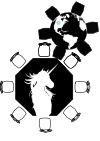

World development efforts to actively drive for a better world.
===

Neither the following list of goals nor the statement/formulation of any of the goals itself ever is meant to be complete. Nothing is perfect.
<a href="./standards.md" alt="">Development standards</a>

Safety Warning
---
Whenever machines are operated (e.g. to manufacture or postprocess parts) always pay attention to your safety, i.e. don't rush, chat or get distracted in other ways while operating/servicing hazardous machines or conducting potentially dangerous operations.

Development Mission Statement:
---
*For the goals we bake, the best and simplest (yet ethical) solutions we take.*

### More development guidelines:

* Respect artistic freedom. Forbidding is no solution. (As learned from history during Nazi-Germany period of 1933..1945 where lots of things were forbidden, which potentially is difficult to control, because who decides what is forbidden may be blurry. Someone might have the idea to forbid being Jew. You get the idea. Law is no easier than technology, its purpose should be to clarify why what is law and to prevent laws that contradict basic rights/other ethical laws.)
* Lead by example, do not discredit work of others. Don't remove/delete work of others without prior bidirectional communication and if then give the reason.
Especially important for deleting development branches despite all the work still residing in local repositories due to Git's distributive nature. Do not offend others, skip/ignore instead.*

Goals
---

*Note: Any project may define additional goals but must not deny, defy or turn the positive attitude of any of the following goals to negative.*

* Reason, not power rules. Give reasons at all times. An argument/hypothesis without supporting reason is not helpful/valid. Prefer reasoning and discurs over overrule by force, power, money or similar.
* Philosophical questions asking for the why and how something shall be helpful for the world must be asked, and the answers then must be critically questioned again, until all potential contradictions are ruled out - or a contradiction to an answer is found.
* An environmental friendly world.
* Fair. Neither exploit nor abuse.
* Respect all positive attitude ethics.
* Respect all ethnicities.
* Respect human and other basic or substantial rights like:
* Reciprocity: "Do as you would be done by. Though if you want harmful things to be done to you, then this contradicts other basic laws like human rights, thus don't do such e.g. harmful things to others!"
* Respect all religions. Take neutral stance. (Philosophers' view.)
* Respect law. *If a law has been created based on interests of individuals or contradicts or endangers basic rights or any of the listed goals of worlddevelopment, then go the philosopher's route and discuss the topic with a mix of people from different societies, e.g. not only friends but also scientists, lawyers, ... maybe there are just misconceptions. Else increase public pressure by starting a public poll and peaceful campaigns.*
* Anti force, cruelty, torture.
* Respect gender equality.
* Improve living standard of the world (not anti rich-poor scissor directly; instead not further rich-poor scissor and active raise living standard of the poor).
=> Less pain. Terrorists also might have a potentially more difficult time recruiting poor people if their situation no longer is hopeless or know the world cares for them.
* Keep it low-tech. Nothing against high-tech.
* Level living standard of all beings to a high level.
* Prevent war and conflict by reconciliation, dialogue, compromise, entirely secret negotiations to allow both parties to not lose their face / be defied publicly.
* Positive attitude. Constructive, objective, i.e. not subjective.
* Non-commercial, non-profit. (Don't let money rule decisions.)
* Share alike if positive effect on the world. Open technology, for a better world. Stop reinventing the wheel.

License (copyright) | Unlicense (public domain)
---
If contents are not opting out of the licensing and copyright things,  then the License of repository contents directly 'owned'/maintained by worlddevelopment if not specified is:
*CC-BY-SA* (Creative Commons Attribution Share Alike)

NC (non-commercial) supplement that restricted the use has been removed because it only works in theory, in practice the supplement simply would be ignored and the "copy"/"robbery" be hidden as company secret or similar.
The Non-commercialization restriction often prevents companies openly stating that they use/rely/build-upon an open source project because then it'd be clear that they'd not be allowed to legally use it in their commercial projects and contribute improvements back "upstream". Instead it may be used illegally as described above.

While taking note of

for legal reasons if a more permissive license other than the above default is desired, `CC0` is preferred over `Unlicense` as putting content directly into the `Public domain` is not compatible with laws of some countries (e.g. Germany).

#### Explanation (for more information check the license wording / public domain legal definition of the corresponding country)
*Attribution* means that links to the creators have to be provided properly visible.

*Share-alike* means that e.g. built-upon sources must be provided at latest on release.

About world development tools/toolchains:
---
Contrary to the contents of many repositories, the tools, toolchains, ... that world development uses or develops, at times neither releases/binaries, nor development files/machines/sources are provided.

This to not only promote open source (by optionally giving the tool/toolchain development files/machines/sources away for finished and published open source projects), but to prevent all actions
like abuse of these tools/toolchains either through commercialisation through third-parties that not feel connected to worldevelopment goals.

Free, not open source, tools are tolerated/may be used for world development if compatible to worlddevelopment goals.

